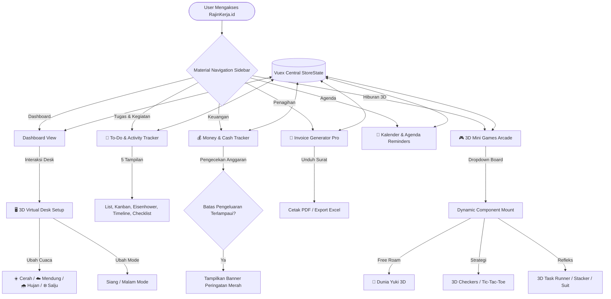

# 🎯 RajinKerja.id - Integrated Workflow, Task & 3D Arcade OS

**RajinKerja.id** adalah sebuah sistem operasi produktivitas premium berbasis web yang mengintegrasikan manajemen alur kerja (workflow), pelacakan keuangan, penagihan invoice, agenda kalender, dan simulasi 3D interaktif dalam satu portal aplikasi Single Page Application (SPA).

Aplikasi ini dikembangkan menggunakan **Vue 3**, **Vuex**, **Three.js**, dan **Bootstrap 5** untuk menyajikan antarmuka modern, premium, responsif, serta bebas lag.

---

## 🗺️ Diagram Alur Sistem (Flowchart)

Berikut adalah visualisasi bagaimana pengguna bernavigasi dan bagaimana data terpusat di dalam **Vuex Store** terhubung secara real-time ke seluruh modul:



---

## 📑 Penjelasan Fitur Per Halaman (Modul)

### 1. 🖥️ Dashboard & 3D Virtual Desk Simulator
*   **Pusat Informasi Utama:** Menampilkan ringkasan profit bersih keuangan bulan berjalan, jumlah proyek aktif, agenda deadline terdekat, dan progress tugas.
*   **Simulator Setup Meja 3D:** Simulasi meja kerja interaktif yang mendukung rotasi kamera 360°, tombol Siang/Malam (Night Mode), ON/OFF lampu meja, serta back-light RGB yang berubah warna secara dinamis.
*   **Live Weather Presets:** Integrasi efek cuaca langsung di dalam simulator (Cerah, Mendung, Hujan Deras dengan partikel air, dan Salju dengan butiran es yang melayang dan bergoyang lambat).

### 2. 📝 To-Do & Activity Tracker (5 View Modes)
*   **Standard List:** Tampilan daftar tugas klasik dengan filter kategori dan prioritas.
*   **Kanban Board:** Papan drag-and-move kolom (To-Do, In Progress, Review, Done) untuk manajemen tugas ala scrum/agile.
*   **Matriks Eisenhower:** Pembagian otomatis tugas berdasarkan urgensi dan kepentingan (Do First, Schedule, Delegate, Eliminate).
*   **Timeline Deadline:** Mengelompokkan aktivitas berdasarkan kronologi tanggal jatuh tempo tugas.
*   **Checklist Ringkas:** Tampilan minimalis untuk pengerjaan cepat yang dioptimalkan untuk mobile.
*   **Bulk Input:** Memungkinkan pengisian puluhan tugas sekaligus hanya dengan memisahkan teks per baris.

### 3. 📁 Workspace Proyek & Kontrak
*   Mendaftarkan nama klien, judul proyek, nilai kontrak (rate), deskripsi pengerjaan, dan status progress bar (0% - 100%).
*   Dilengkapi tombol shortcut untuk langsung memindahkan detail proyek ke editor Invoice Generator.

### 4. 💰 Money & Financial Tracker
*   **Arus Kas:** Pencatatan pemasukan (Income) dan pengeluaran (Expense) secara terpisah.
*   **Batas Anggaran (Budget Threshold):** Pengaturan limit pengeluaran bulanan. Jika pengeluaran melampaui batas, sistem akan menampilkan banner alert merah menyala secara otomatis.
*   **Ekspor Data:** Mengunduh ringkasan transaksi finansial ke format spreadsheet `.xlsx` (Excel).

### 5. 📄 Invoice Generator Pro
*   Pembuat invoice digital yang secara instan menghitung subtotal, pajak PPN (%), diskon nominal, dan total tagihan bersih.
*   Mendukung bulk input item invoice menggunakan format pemisah koma (CSV-like).
*   Mendukung unduh dokumen PDF secara offline menggunakan library `jsPDF`.

### 6. 📅 Kalender Agenda & Pengingat
*   Tampilan grid bulanan yang menyatukan seluruh entitas tanggal dari modul To-Do (deadline), Proyek (jatuh tempo pengerjaan), Invoice (batas bayar), dan agenda meeting berjam (Timed Events).
*   Mendukung laci geser (Slide-over drawer) untuk melihat agenda harian mendetail.

### 7. 📝 Sticky Notes & Markdown Docs
*   Papan memo tempel digital berwarna-warni yang mendukung penulisan teks Markdown dengan live rendering HTML.
*   Sistem **Auto-Save** yang berjalan di background setiap 1.5 detik untuk mengamankan draf coretan agar tidak hilang saat browser tertutup.

### 8. 🎮 3D Mini Games Arcade (WebGL/Three.js)
*   Sistem pemuatan performa adaptif: game dimuat satu per satu menggunakan dropdown agar performa browser tetap ringan dan terhindar dari crash memory WebGL.
*   **Dunia Yuki 3D:** Adaptasi game petualangan eksplorasi pulau low-poly dengan interaksi dialog bersama Nyx, pencatatan jarak tempuh, mengoleksi koin emas berputar, efek suara prosedural, ayunan bergoyang otomatis, dan double jump dengan tombol **E**.
*   **3D Tic-Tac-Toe:** Bermain melawan AI pintar di atas papan metalik mengkilap dengan efek pencahayaan bersinar.
*   **3D Checkers:** Permainan dam-daman lengkap dengan aturan lompat makan lawan menggunakan bidak berwarna abu-abu vs merah.
*   **3D Task Runner:** Game arkade menghindari rintangan "Deadline Block" & "Bug" dengan melompat dan berganti jalur secara dinamis.
*   **3D Milestone Stacker:** Game menumpuk balok beton melayang setinggi mungkin dengan pemotongan sisa balok secara real-time.
*   **3D Suit (Rock-Paper-Scissors):** Arena suit Jepang 3D dengan visual animasi goyang mesh tangan batu, gunting, kertas.

---

## 🔮 Rencana Pengembangan Masa Depan (Future Plans)

1.  **Multiplayer & Collaboration Room (Real-time WebSockets):**
    Memungkinkan tim karyawan berkolaborasi secara langsung (real-time chat, shared Kanban Board, dan multiplayer lobby pada game Dunia Yuki 3D).
2.  **AI Scheduling Copilot:**
    Integrasi model kecerdasan buatan lokal untuk membantu memprioritaskan tugas karyawan berdasarkan tingkat kesulitan dan target deadline.
3.  **Kustomisasi Aset Meja 3D (Object Importer):**
    Memungkinkan pengguna mengunggah file 3D (.gltf / .obj) aksesoris meja kerja mereka sendiri untuk disimulasikan secara personal.
4.  **Aplikasi Mobile Native (Capacitor/Cordova):**
    Membungkus codebase menjadi aplikasi Android dan iOS agar dapat diakses secara native dengan dukungan push notification agenda.

---

## 🚀 Panduan Instalasi & Menjalankan Project

### Prerequisites
Pastikan Anda sudah menginstal **Node.js** (versi 16 atau lebih baru) dan **Yarn** / **npm** pada sistem Anda.

### 1. Kloning Repositori
```bash
git clone https://github.com/itsmebroarif/rajinkerja-id.git
cd rajinkerja-id
```

### 2. Instalasi Dependensi
```bash
yarn install
# atau menggunakan npm
npm install
```

### 3. Menjalankan Server Pengembangan (Dev Server)
```bash
yarn serve
# atau menggunakan npm
npm run serve
```
Buka [http://localhost:8080](http://localhost:8080) pada browser Anda untuk melihat aplikasi berjalan.

### 4. Build Kompilasi Produksi (Production Build)
```bash
yarn build
# atau menggunakan npm
npm run build
```
Hasil file siap deploy akan berada di dalam direktori `/dist`.
